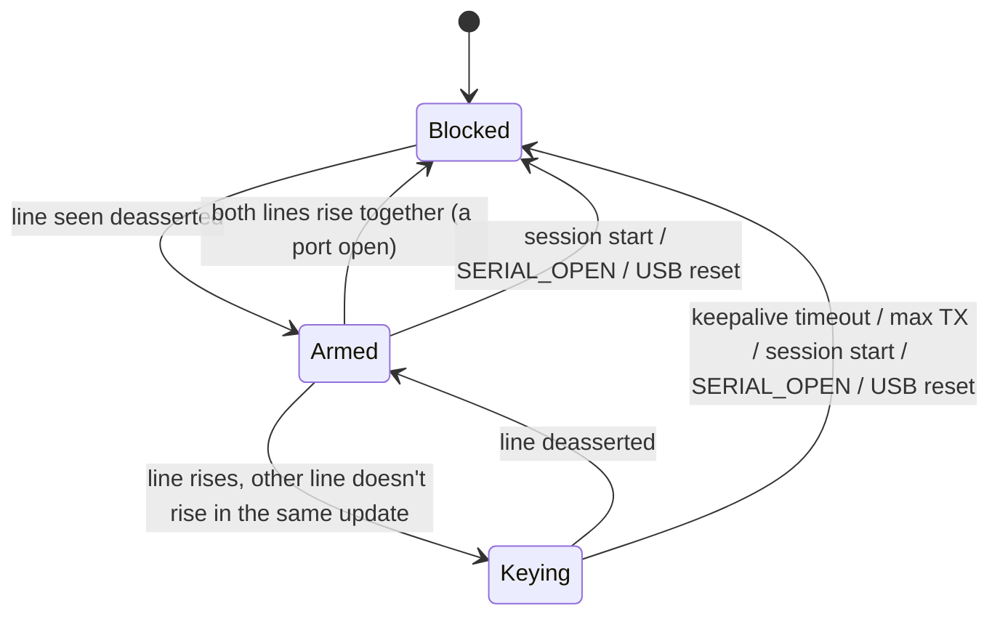

<!--
SPDX-FileCopyrightText: 2026 Reid Crowe, N0RC
SPDX-License-Identifier: CC-BY-4.0
-->

# System architecture

Issue: [#13](https://github.com/Reid-n0rc/open-bt-rig-interface/issues/13).
Written 2026-09-24. Design basis:
[ADR-0008](decisions/ADR-0008-host-links-esp32-s3.md) (ESP32-S3-MINI-1-N8,
Bluetooth LE + wired USB-C, no Bluetooth Classic) and
[ADR-0007](decisions/ADR-0007-protocol.md) (the protocol and its transports).
The byte-level protocol is [`protocol/SPEC.md`](../protocol/SPEC.md).
Candidate parts come from [`core-devices.md`](research/core-devices.md); none is
final until its own issue decides it.

## 1. What connects to what

- **Host side:** Bluetooth LE (any host, through an app that implements the
  protocol), or wired USB-C (standard USB classes).
- **Radio side, the same in both modes:** the AUDIO jack (RX/TX audio, PTT),
  the SERIAL jack (3.3 V logic, RS-232, CI-V), and the radio USB port (USB host
  to the radio's USB-serial chip and sound card)
  ([`radio-connectors.md`](requirements/radio-connectors.md)).

## 2. Block diagram

```text
 HOST SIDE                         DEVICE                                        RADIO SIDE

 Bluetooth LE  ~~~~~~~~~~~~~  ESP32-S3-MINI-1-N8
 (GATT, L2CAP CoC)            (NimBLE; BLE TX power ≤ grant cap)
                               │ I2S          │ UART + mode GPIOs    │ PTT GPIO
                               ▼              ▼                      ▼
                          audio codec    mode switches,          PhotoMOS closure
                          (48 kHz)       RS-232 transceiver,     (off unless driven)
                               │         CI-V buffer                 │
                               ▼              ▼                      ▼
                          ═══════════ isolation (transformers, digital isolators) ═══════════
                               │              │                      │
                               ▼              ▼                      ▼
                          AUDIO jack      SERIAL jack             AUDIO jack
                          tip/ring 1      (TRRS)                  ring 2 (PTT)

                               ESP32-S3 USB OTG ── S2 ──┐   ┌── S1 ── radio USB-A port (VBUS blocked)
                                                        │   │
 USB-C  ── 5.1 kΩ Rd ── 2-port USB hub ── port 2 ───────┘   │     (wired mode: S1 → hub port 1,
 (wired)                              └── port 1 ───────────┘      S2 → hub port 2)
                                     S2 ◄──── direct link ────► S1 (Bluetooth mode: ESP32-S3 is
                                                                     USB host to the radio)

 Power: USB-C 5 V │ radio accessory 13.8 V (variant R) │ 12 V vehicle (variant M)
 Supervisor / window watchdog: can reset the module and hold PTT off
```

- **Bluetooth mode:** S1 and S2 join the radio USB port to the ESP32-S3, which
  is USB host to the radio's chips. The hub is idle.
- **Wired mode:** S1 routes the radio port to hub port 1, and S2 routes the
  ESP32-S3 (now a USB device) to hub port 2. The Bluetooth radio is off.
- The device never powers a radio through USB: VBUS on the radio port is
  blocked in hardware (maintainer decision, 2026-09-24, #9). The protocol
  therefore has no VBUS control or VBUS-fault messages.
- Isolation of the AUDIO and SERIAL jacks is required on variant M and
  whenever the USB-C data link is used ([`constraints.md`](requirements/constraints.md) §6).

## 3. Host transports per OS

From [host compatibility](research/host-compatibility.md) (#6) and
[ADR-0007](decisions/ADR-0007-protocol.md). The protocol runs over every
transport in the "protocol" columns.

| Host | BLE: GATT | BLE: L2CAP CoC | Wired: USB network (TCP) | Wired: CDC-ACM serial | Wired: USB audio (UAC1) |
|---|---|---|---|---|---|
| iOS / iPadOS | Yes | Yes | Built-in USB Ethernet driver; NCM **(verify, #18)** | **No** app access | Yes |
| macOS | Yes | Yes | NCM **(verify, #18)** | Yes | Yes |
| Android | Yes | API 29+ | NCM in Android 14 GKI kernels; interface bring-up **(verify, #18)** | Apps only (USB host API) | Yes (UAC1 subset) |
| Windows 11 | Yes | **No public API** | Yes (`UsbNcm.sys`) | Yes (`usbser.sys`) | Yes |
| Windows 10 | Yes | **No public API** | **No in-box NCM driver** | Yes | Yes |
| Linux | Yes | Yes (5.10+) | Yes (`cdc_ncm`) | Yes (`cdc_acm`) | Yes |

Which wired USB functions the device enumerates depends on the radio type,
because the ESP32-S3 has only 4 IN endpoints besides endpoint 0
([SPEC §14.1](../protocol/SPEC.md#141-usb-functions-and-the-endpoint-budget)).

## 4. Data paths

### 4.1 Bluetooth mode

| Function | Radio with USB serial + USB audio | Radio with USB serial + analog audio | Radio with SERIAL-jack serial + analog audio |
|---|---|---|---|
| **CAT** | Host `CAT_DATA` (port 1–4) ↔ ESP32-S3 USB host ↔ radio's USB-serial chip | Same | Host `CAT_DATA` (port 0) ↔ UART ↔ mode switches ↔ SERIAL jack |
| **Line settings** | `SERIAL_SET` → radio chip's line coding | Same | `SERIAL_SET` → UART; `SERIAL_JACK_MODE` → switches |
| **PTT** | `PTT_SET` / mapped `MODEM_LINES` → logical PTT → AUDIO-jack closure and/or RTS/DTR on the radio chip (`PTT_TARGETS`); or a CAT command | Same | `PTT_SET` / mapped `MODEM_LINES` → AUDIO-jack closure; or a CAT command |
| **RTS/DTR** | `MODEM_LINES` → radio chip (pass-through, guarded) or → PTT (`LINE_MAP`) | Same | `MODEM_LINES` → PTT only (the SERIAL jack has no RTS/DTR) |
| **RX audio** | Radio USB sound card → USB host → rate matcher → `AUDIO_FRAME` | AUDIO jack tip → transformer → codec (48 kHz) → resampler → `AUDIO_FRAME` | Same as middle |
| **TX audio** | `AUDIO_FRAME` → jitter buffer → rate matcher → radio USB sound card | `AUDIO_FRAME` → jitter buffer → resampler → codec → transformer → AUDIO jack ring 1 | Same as middle |

Audio runs one direction at a time over Bluetooth, at 12 or 16 kHz, clocked by
the device's sample clock ([SPEC §9](../protocol/SPEC.md#9-audio-over-bluetooth-le)).

### 4.2 Wired mode

| Function | Radio with USB serial + USB audio | Radio with USB serial + analog audio | SERIAL-jack radio, profile network | SERIAL-jack radio, profile serial (default) |
|---|---|---|---|---|
| **USB functions** | Radio's chips (via hub) + NCM + CDC-ACM control port | Radio's serial (via hub) + NCM + UAC1 | NCM + UAC1 | CDC-ACM bridge + UAC1 |
| **CAT** | Host ↔ radio's own USB-serial chip (native driver) | Same | Protocol `CAT_DATA` over TCP ↔ SERIAL jack | Native COM/tty port ↔ SERIAL jack |
| **PTT** | Radio chip RTS/DTR or CAT; or control-port RTS/DTR, or `PTT_SET` → AUDIO-jack closure | Radio chip RTS/DTR or CAT; or `PTT_SET` over TCP → AUDIO-jack closure | `PTT_SET` / `MODEM_LINES` over TCP → AUDIO-jack closure | Bridge-port RTS/DTR → AUDIO-jack closure |
| **Audio** | Radio's own USB sound card (device audio idle) | Device's UAC1 sound card ↔ codec | Device's UAC1 ↔ codec | Device's UAC1 ↔ codec |
| **Configuration** | TCP or control port | TCP | TCP | Bluetooth only (or switch profile) |

iOS/iPadOS apps use only the TCP column; with a USB-serial radio they get no
CAT in wired mode, because the radio's chip is behind the hub
([SPEC §14.1](../protocol/SPEC.md#141-usb-functions-and-the-endpoint-budget)).

## 5. PTT safety state machine

Logical PTT is the OR of its active sources, gated by the fail-safes
([SPEC §8](../protocol/SPEC.md#8-ptt-and-modem-lines)). The hardware keeps the
PTT closure open unless the MCU actively drives it, so a hung or unpowered MCU
can't key the radio (REQ-PTT-008).

```mermaid
stateDiagram-v2
    [*] --> Off: power-on / reset / brownout / watchdog (reason BOOT or FAULT)
    Off --> Keyed: a source activates\n(PTT_SET 1, armed line rises alone,\ntone sequence lead, pass-through line)
    Keyed --> Keyed: KEEPALIVE / PTT_SET 1 / MODEM_LINES\n(refresh keepalive)
    Keyed --> Off: every source released (RELEASED)
    Keyed --> Off: keepalive expired, protocol sources dropped (KEEPALIVE_TIMEOUT)
    Keyed --> LockedOut: max-TX timer expired (MAX_TX)
    Keyed --> Off: firmware lock-up, internal watchdog resets the device\n(PTT off during and after; WATCHDOG reported afterwards)
    LockedOut --> Off: every source released
    LockedOut --> LockedOut: key attempt refused (LOCKED_OUT)
    Keyed --> Off: session end, link or transport lost,\nUSB unplug/suspend/reset, port closed,\nhost-mode or PTT config change
    LockedOut --> Off: session end / link lost
```



Per line mapped to PTT (RTS or DTR, `LINE_MAP` action 1), the arming rule that
keeps a port open from keying
([SPEC §8.4](../protocol/SPEC.md#84-arming-opening-a-port-must-never-key)):



Timers (defaults accepted by the maintainer, all configurable): keepalive
3000 ms (500–10 000 ms), max TX 300 s (at least 10 s, no upper bound; can't
be switched off). There is no external hardware PTT timer: after a firmware
lock-up the ESP32-S3's internal watchdog resets the device, with PTT off
during and after the reset (REQ-PTT-011). Every
fail-safe path gets a host-run firmware test (REQ-PTT-010, #14, #15).

## 6. Host-link and connection state machine

```mermaid
stateDiagram-v2
    [*] --> Boot: PTT off, USB switches in their safe position
    Boot --> Detect
    Detect --> Wired: HOST_MODE forces wired, or VBUS on USB-C and a host enumerates the device
    Detect --> Bluetooth: HOST_MODE forces Bluetooth, or no enumeration (charger only)

    state Bluetooth {
        [*] --> Advertising
        Advertising --> Connected: host connects
        Connected --> Secured: encrypted with a bonded host\n(new bonds only inside the pairing window)
        Secured --> Session: HELLO on GATT or L2CAP CoC
        Session --> Session: HELLO again (restart)
        Session --> Advertising: link lost / supervision timeout (PTT off)
        Secured --> Advertising: disconnect
    }

    state Wired {
        [*] --> ProbeRadio: ESP32-S3 as USB host on the radio port
        ProbeRadio --> Enumerated: choose USB functions, switch S1/S2 to the hub, start the USB device stack
        Enumerated --> WiredSession: HELLO over TCP or the control port
        WiredSession --> Enumerated: TCP closed / new HELLO elsewhere (PTT off)
        Enumerated --> Suspended: USB suspend (PTT off)
        Suspended --> Enumerated: resume
    }

    Wired --> Detect: USB-C unplugged or USB reset (PTT off, USB stack restarted)
    Bluetooth --> Detect: a USB host appears on USB-C (auto mode; PTT off)
```



- **Pairing window:** new bonds only during a window opened by power-on or a
  pairing button (default 120 s, configurable), closed early by the first new
  bond or by entering wired mode. Outside it only bonded hosts get past
  `Connected` ([SPEC §13.5](../protocol/SPEC.md#135-security-and-pairing)).
- **Mode switches** restart the USB stack with PTT off throughout
  (REQ-FW-007, REQ-PTT-009). The Bluetooth radio is off in wired mode.
- **Reconnection:** after a Bluetooth link loss the device advertises again at
  once. Bonded hosts reconnect, send `HELLO`, read `CAPS` again, reopen ports
  and resend the time. The device keeps its configuration and the UTC mapping,
  but not session state: PTT, audio, open ports and CAT credit start fresh
  ([SPEC §8.7](../protocol/SPEC.md#87-session-end)).
- **Detection timing** (how long the device waits for enumeration before
  choosing Bluetooth, and how it probes the radio port first) belongs to #44
  **(verify)**.

## 7. Open items

- NCM on iOS/iPadOS/macOS and Android, BLE throughput per OS, and RTS/DTR at
  port open on Windows and macOS: bench tests (#18).
- Whether `esp_tinyusb` builds each wired composite, and RAM for lwIP on the
  -N8 (no PSRAM): #44.
- EU conformity (#59) may add access control to the wired transports.
- Known limitation (accepted): wired iOS/iPadOS with a USB-serial radio has no
  CAT (§4.2).
