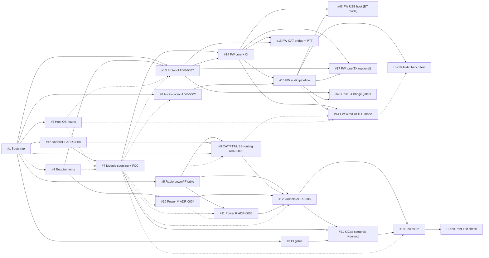

<!--
SPDX-FileCopyrightText: 2026 Reid Crowe, N0RC
SPDX-License-Identifier: CC-BY-4.0
-->

# Roadmap: revision A

This document is the plan for the first revision (revision A) of the open
Bluetooth radio interface. The **live checklist is tracking issue
[#22](https://github.com/Reid-n0rc/open-bt-rig-interface/issues/22)**. This
file explains the order, the dependencies, what "done" means for each phase,
and which checks gate a merge. Keep the two in sync (see
[Keeping this document current](#keeping-this-document-current)).

👤 marks a `human-task` issue: it needs a person, physical hardware or
accounts, and isn't for agents.

## Goal

An open hardware and firmware Bluetooth interface between a transceiver and a
host that carries **CAT serial, PTT (CAT command, RTS/DTR, direct PTT line) and
full-duplex audio**. It appears as a standard **Bluetooth audio device plus a
serial connection** on iOS, macOS, Android, Windows and Linux; on iOS the
serial connection is BLE and available to apps only.

- Variants: **R** (powered from the radio's accessory DC or USB-C) and **M**
  (automotive 12 V, harsh environment).
- Enclosure: 3D printed.
- Constraints: [`docs/requirements/constraints.md`](requirements/constraints.md).

## Merge gates

Every PR targets `dev` and links its issue (`Closes #N`). Signed commits (SSH or
GPG) are preferred but not required (see [`AGENTS.md`](../AGENTS.md)). In addition:

| Change in the PR | Must pass before merge |
|---|---|
| Any file | REUSE lint; KiCad version consistency (`KICAD_VERSION` against every checked-in KiCad file) |
| A schematic (`*.kicad_sch`) | **ERC** with `kicad-cli sch erc --exit-code-violations`. Errors fail. |
| A PCB (`*.kicad_pcb`) | **DRC** with `kicad-cli pcb drc --exit-code-violations`. Errors fail. Plus the silkscreen revision check (`${REVISION}` on the silkscreen, title-block revision matching the `rev<X>` folder and tag). |
| Firmware | Firmware build and host tests (added by #14). |

- These checks run in GitHub Actions, in the `kicad/kicad:<KICAD_VERSION>`
  container, and are added by **#3**.
- After #3 merges, the maintainer adds the check names to the `main`/`dev`
  ruleset as **required status checks**, so a failing ERC or DRC blocks the
  merge.
- Whether DRC *warnings* should also fail is an open question in #3. The
  default is that errors fail and warnings are reported.
- Until #3 lands, a PR that changes a schematic or PCB must include the local
  `kicad-cli` ERC/DRC output in its description.

## Phases

### Phase 0: Foundation

- #1 Bootstrap: agent docs, REUSE licensing, constraints, repo skeleton (done, PR #2)
- #3 CI: REUSE lint, KiCad version consistency, ERC/DRC gates, silkscreen revision check
- #23 This roadmap document

**Exit criteria:** the check workflows are green on `dev` and marked as
required status checks.

### Phase 1: Requirements and research (can run in parallel)

- #4 Requirements spec (app-neutral)
- #5 Research: per-radio power and interface table
- #6 Research: five-OS host compatibility matrix (wired USB-C classes, BLE throughput)
- #42 Research: core device shortlist, host links and radio connectors (ADR-0008)
- #8 Decision: audio codec and isolation transformers (ADR-0002)
- #9 Research/design: CAT/PTT circuits, RS-232-tolerant serial modes, USB routing (ADR-0003)
- #10 Research/design: variant M automotive 12 V front end (ADR-0004)
- #11 Research/design: variant R power (radio DC, USB-C, VBUS to the radio) (ADR-0005)

**Exit criteria:** requirements merged. Each research issue has merged its
findings or ADR. Every `(verify)` item in `constraints.md` is confirmed,
corrected or has a follow-up issue.

### Phase 2: Key decisions

- #7 Decision: confirm the ESP32-S3-MINI-1 module (sourcing, FCC integration) per ADR-0008
- #12 Decision: variants, board strategy, folder layout, tag scheme (ADR-0006)
- #13 Architecture and app-neutral versioned protocol spec with golden vectors (ADR-0007)

**Exit criteria:**

- ADR-0008 (and ADR-0001 if #7 needs one), ADR-0006 and ADR-0007 are accepted.
- The module's FCC ID and integration-guide constraints (antenna, keep-out) are
  recorded.
- `protocol/` has a versioned spec and golden vectors.

### Phase 3: Firmware (on the module vendor's dev kit before custom hardware)

- #14 Firmware: portable core, HAL skeleton, host tests, firmware CI
- #15 Firmware: transparent CAT bridge over BLE and wired USB with PTT/RTS/DTR fail-safes
- #16 Firmware: audio pipeline (codec and radio USB sound card to BLE stream and USB Audio device)
- #43 Firmware: USB host in Bluetooth mode (radio USB-serial and sound card)
- #44 Firmware: wired USB-C mode (USB CDC-ACM + USB Audio device, mode switching)
- #17 Firmware (optional): on-device scheduled tone-sequence TX
- #45 Host software (later): desktop Bluetooth bridge
- 👤 #18 Bench test the audio paths against a wired interface on all five OSes

**Exit criteria:**

- On the dev kit, CAT and PTT work from all five host OSes, over Bluetooth and wired USB-C.
- The PTT fail-safes are proven: off at boot, reset, brownout and disconnect;
  keepalive timeout; maximum TX timer.
- The #18 bench results are recorded.

### Phase 4: Hardware

- #21 KiCad 10 project setup via Konnect: one board, `hardware/boards/interface/revA/`, with design variants R and M ([ADR-0006](decisions/ADR-0006-variants-and-board-strategy.md)); title block, `${VARIANT}`/`${REVISION}` silkscreen, libs, jobset
- Per-block schematic issues (radio module, audio, CAT/PTT/RTS/DTR, USB routing (hub, switches, USB-C), power R, power M, connectors). *Created after Phase 2.*
- Parts list with distributor stock and lifecycle checks (Digi-Key, Mouser, LCSC). *To be created.*
- Design review (Konnect review workflow). *To be created.*
- PCB layout of the one board, both variants (antenna keep-out, EMC). *To be created.*
- Release workflow: fab outputs exported with `--variant <variant>` (from the jobset where it supports variants), attached to `hw-<variant>-rev<X>-v<semver>` releases. *To be created.*

**Exit criteria:**

- ERC and DRC are clean in CI for the board (they check every variant's parts at once).
- The design review is signed off.
- The parts list has at least two sources per key part, all with an active
  lifecycle.
- A release candidate's fab outputs build from the jobset.

### Phase 5: Enclosure

- #19 Parametric 3D-printed enclosure per variant (CI-exported STL/3MF)
- 👤 #20 Print and fit-check the enclosures (RF and heat soak)

**Exit criteria:** the enclosures fit the revision A boards. The antenna
keep-out is respected. The ASA version of variant M passes the heat soak.

### Phase 6: Bring-up and compliance (issues to be created)

- 👤 Fabricate and assemble revision A per variant (one board design, R and M builds)
- 👤 Bench bring-up per variant (power rails, PTT fail-safe, CAT, audio)
- 👤 Variant M automotive pulse testing (ISO 7637-2 / ISO 16750-2)
- 👤 FCC Part 15B pre-scan and SDoC documentation
- 👤 On-air testing with several radios and all five host OSes

**Exit criteria:**

- Bring-up reports are in `docs/bringup/` and the compliance evidence is in
  `docs/compliance/`.
- The first releases are tagged `hw-R-revA-v1.0`, `hw-M-revA-v1.0` and
  `fw-v1.0.0`.

## Dependencies

Solid arrows mean "blocked by". Dashed arrows mean "uses the result of" (the
work can start earlier and be finalized once that input lands). The graph is
built from each issue's *Dependencies* section.

Critical path to the first board: **#1 → #5 → (#9, #11) and #4 → #10 → #12,
with #7 → #21 → schematics → review → layout → fab (👤) → bring-up (👤)**.

## Releases and tags

- `dev` is pre-release and the default branch. `main` changes only through a
  `dev` → `main` PR per release.
- Tags are independent per stream:
  - hardware `hw-<variant>-rev<X>-v<semver>` (for example `hw-R-revA-v1.0`);
  - firmware `fw-v<semver>`;
  - protocol `proto-v<semver>`.
- Fabrication outputs (Gerbers, drill, BOM, placement files, PDFs) and
  enclosure STL/3MF files are generated by CI and attached to releases, never
  committed.

## Keeping this document current

- **#22 is the source of truth for status** (its checkboxes). This file has no
  checkboxes on purpose, so it can't drift. It is the source of truth for
  order, dependencies, exit criteria and gates.
- When an issue is added, split or re-scoped, update #22 **and** this file in
  the same PR that touches the plan. If no PR is involved, open a small
  documentation issue for the update.
- Update the Mermaid graph whenever an issue's *Dependencies* section changes.
